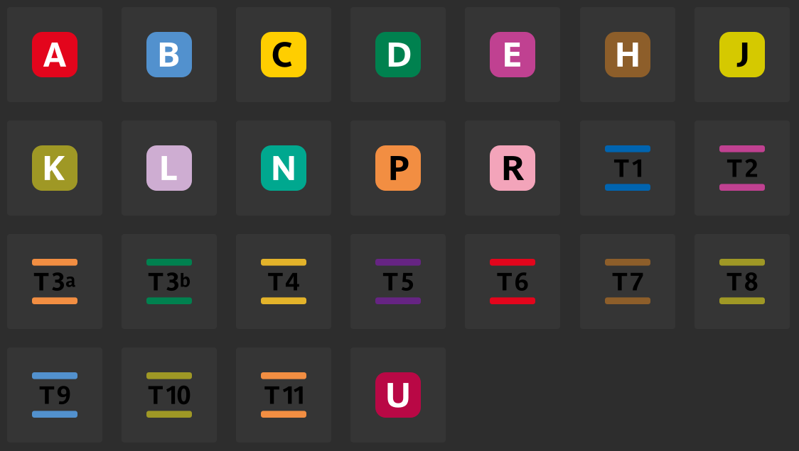
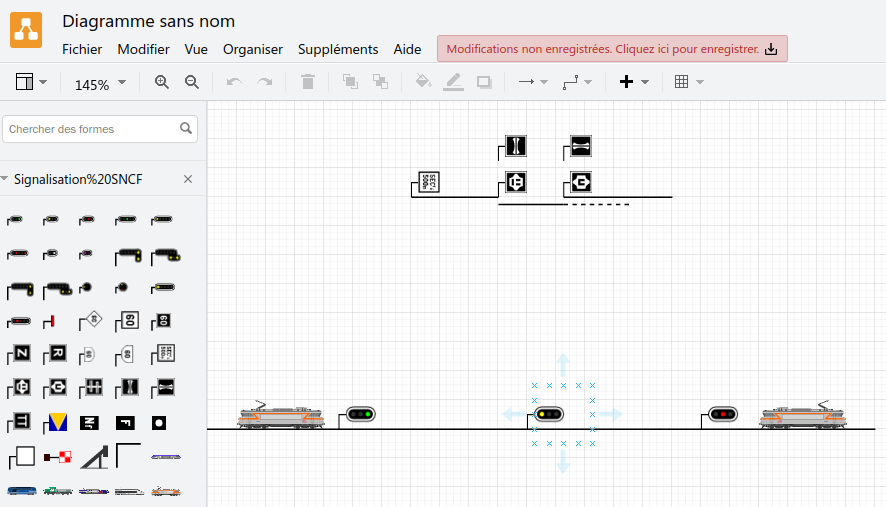

# De quoi s'agit-il ?

Il s'agit des représentations numériques des tableaux, pancartes, panneaux et signaux de la signalisation ferroviaire du réseau ferroviaire national français, exploité entre autres par _SNCF_ notamment. La liste cherche à être exhaustive sans toutefois forcément l'être.

Vous trouverez également dans le répertoire `pictogrammes` les icônes des différentes lignes ferroviaires d'île de France (sauf métro) et les logos de certaines des activités SNCF et filiales.

## Contenu

### Picto et images

- `svg/` format vectoriel de **référence**, c'est le répertoire source de tous les autres
- `svg_schematique/` la même chose dans un format plus schématique
- `svg_schematique_blueprint/` la même chose en couleurs bleu et blanc façon blueprint
- `svg_schematique_gray/` la même chose en noir et blanc
- `png/` l'équivalent du répertoire `svg/` mais au format bitmap, plus lourds et la qualité se dégrade en zoomant
- `sprites/` planches pour utilisation en cartographie ou autre, notamment avec [MapLibre](https://maplibre.org/)

### Autres

- `scripts/` quelques scripts de conversion, création, beaucoup nécessitent [Inkscape](https://inkscape.org/)
- `fonts/` les polices utilisées pour les panneaux
- `Signalisation SNCF.xml` un modèle pour [app.diagrams.net/](https://app.diagrams.net/) pour rapidement créer vos schémas

# Comment contribuer ?

N'hésitez pas à faire des issues si jamais un élément n'était pas correct.

## Graphisme

Pour contribuer, ne réinventez pas la roue, prenez les éléments existants pour les modifier de façon à garantir une certaine homogénéité.

La définition des fichiers est un carré de 64px de côté, cela permet également de conserver un ratio de taille homogène au sein d'une même famille de signalisation.

Pour les pancartes, il est constitué d'un fond noir carré de 64px, un carré vide de 62px avec un contour de 4px, positionné à 1px du bord, puis d'un texte central de 32px de hauteur max, ou 24px si c'est trop long.

Le dossier `fonts` contient la police _SNCF_ utilisée pour les pancartes.

## Nomenclature

Les fichiers respectent les noms internes du référentiel GAIA de SNCF Réseau (colonne TYPE_IF — Type d'Installation Fixe — https://data.sncf.com/explore/dataset/signalisation-permanente/table/ ).
Ils peuvent contenir des espaces et sont en **majuscules**.

Pour les pancartes à « valeur » (type `PN XX à XXXm`, ou `TIV D MOB 40`), la valeur suit le nom du signal. Pour une pancarte d'arrêt des trains à 4 ou 8 voitures, on aura donc `ARRET VOY 4V 8V`.

# Avertissement

Ce matériel est proposé _en l'état_ et sans garantie de mise à jour ou de perfection. Veuillez l'utiliser à vos risques et périls !

Ce projet est un projet strictement personnel n'ayant aucun lien avec _SNCF_ et _SNCF Réseau_.
